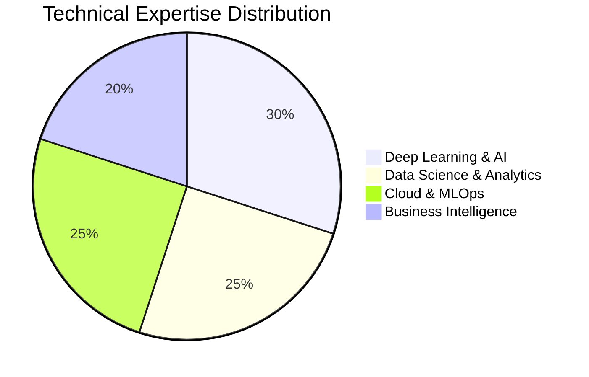

# Anjana Sasi Nambiar

<div align="center">
  
[](https://www.linkedin.com/in/anjanasnambiar)
[](https://tinyurl.com/googlescholar-asnambiar)
[](https://www.anjanasnambiar.com)
[](https://github.com/anjaanasnambiar)

</div>

---

## About Me

  
A Graduate Student specializing in Business Analytics, AI and Data Science,. I am passionate about leveraging technology to drive innovation, solve complex problems, and create impactful solutions. My experience spans machine learning, natural language processing, cloud computing, and business analytics, where I combine analytical thinking, creativity, and technical expertise to develop scalable and efficient solutions.

---

## Technical Skills

<div align="center">

### Programming Languages


### Machine Learning & Data Science


### Deep Learning & NLP


### Computer Vision


### Cloud & MLOps


### Analytics & Visualization


### Databases & Big Data


### Development Tools


</div>

---

## Skill Distribution



---

## 🎮 Fun Zone

<div align="center">

### 🐍 Snake Game - Watch it eat my contributions!


### 🎯 Current Coding Mood
```python
class Developer:
    def __init__(self):
        self.name = "Anjana"
        self.role = "AI Enthusiast & Data Scientist"
        self.language_spoken = ["Python", "Java", "Go", "R"]
        self.current_focus = ["LLMs", "Computer Vision", "MLOps"]
        self.fun_fact = "I can make computers see emotions! 😊"
    
    def say_hi(self):
        print("Thanks for dropping by! Let's build something amazing together! 🚀")

me = Developer()
me.say_hi()
```

### ⚡ Quick Facts
- 🔥 **Favorite AI Model:** GPT-4 (but I'm not biased... much 😉)
- 🎯 **Current Learning:** Advanced MLOps and Multimodal AI
- 🌱 **Growing:** Building production-ready ML systems
- ⚗️ **Experimenting:** Cross-modal learning and neural architectures
- 🎨 **Side Quest:** Making AI more interpretable and fair

### 🎵 Coding Playlist Vibes
```
🎵 Currently coding to: Lo-fi Hip Hop + Neural Network Dreams
🎯 Debug mode: Classical music (Mozart helps with complex algorithms!)
🚀 Deploy mode: High-energy electronic beats
```

</div>

---

## 🌟 What I'm Currently Working On

- 🤖 **Advanced RAG Systems** - Building context-aware AI assistants
- 🎥 **Multimodal AI Applications** - Cross-modal learning projects
- 📈 **MLOps Pipelines** - Scalable ML deployment strategies
- 🧠 **LLM Fine-tuning** - Domain-specific model optimization

---

## 📫 Let's Connect!

I'm always excited to collaborate on innovative AI projects, discuss cutting-edge research, or explore how machine learning can solve complex challenges. Feel free to reach out!

<div align="center">

**🌟 "Building intelligent systems that make a difference" 🌟**

---

*Last updated: July 2025*

</div>
