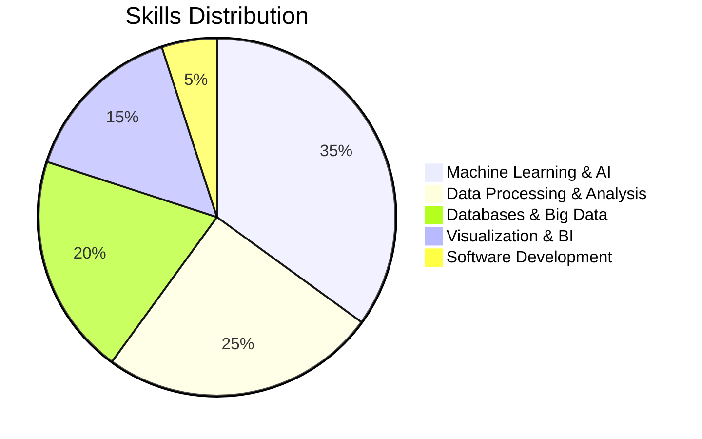

# Anjana Sasi Nambiar

  

### Contact

## About Me

A Graduate Student specializing in Business Analytics, AI and Data Science,. I am passionate about leveraging technology to drive innovation, solve complex problems, and create impactful solutions. My experience spans machine learning, natural language processing, cloud computing, and business analytics, where I combine analytical thinking, creativity, and technical expertise to develop scalable and efficient solutions.

## Research

### Publications

- **Exploring the Power of Deep Learning for Seamless Background Audio Generation in Videos** | *IEEE Access, 2022*
  - Developed deep learning models achieving 89% accuracy with Temporal Segment Networks (TSN)
  - [Read Paper](https://doi.org/10.1109/ACCESS.2022.10306607)

- **Comparative Study of Deep Classifiers for Early Dementia Detection Using Speech Transcripts** | *IEEE, 2022*
  - Achieved 81.2% accuracy with BERT+BiLSTM models
  - Implemented various transformer models and word embedding techniques
  - [Read Paper](https://doi.org/10.1109/ACCESS.2022.10306607)

- **Design of Super Mario Game Using Finite State Machines** | *Computer Networks and Inventive Communication Technologies, 2022*
  - Applied formal language theory to game development
  - [Read Paper](https://doi.org/10.1007/978-981-19-3035-5_55)

## Tech Stack

  
### Languages & Tools
  

### Machine Learning & AI

### Data Processing & Big Data

### Databases

### Visualization & BI

### Skill Distribution

## Additional Skills

- **Version Control:** Git
- **Operating Systems:** Linux, Windows
- **Project Management**
- **Research & Academic Writing**

## Let's Connect!
Feel free to reach out for collaborations or discussions about AI, data science, or analytics projects!
